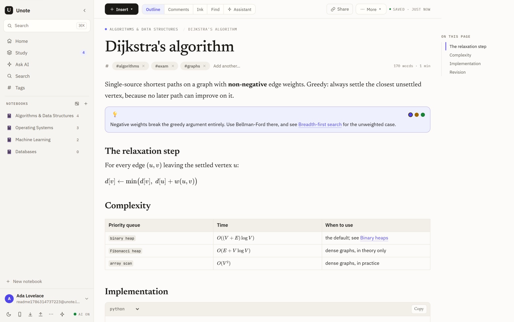
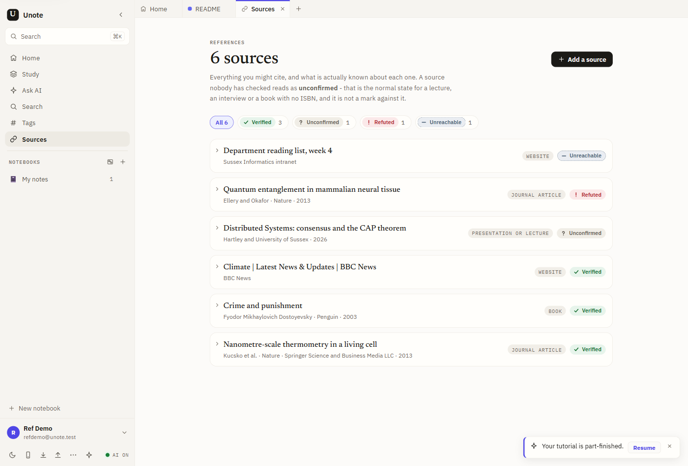
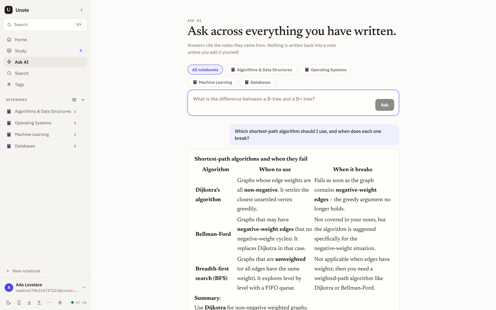
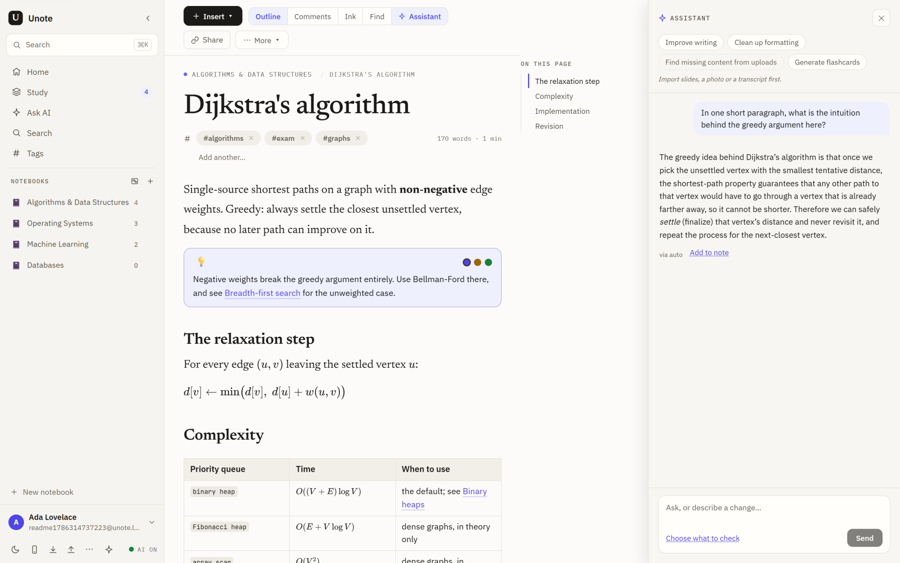
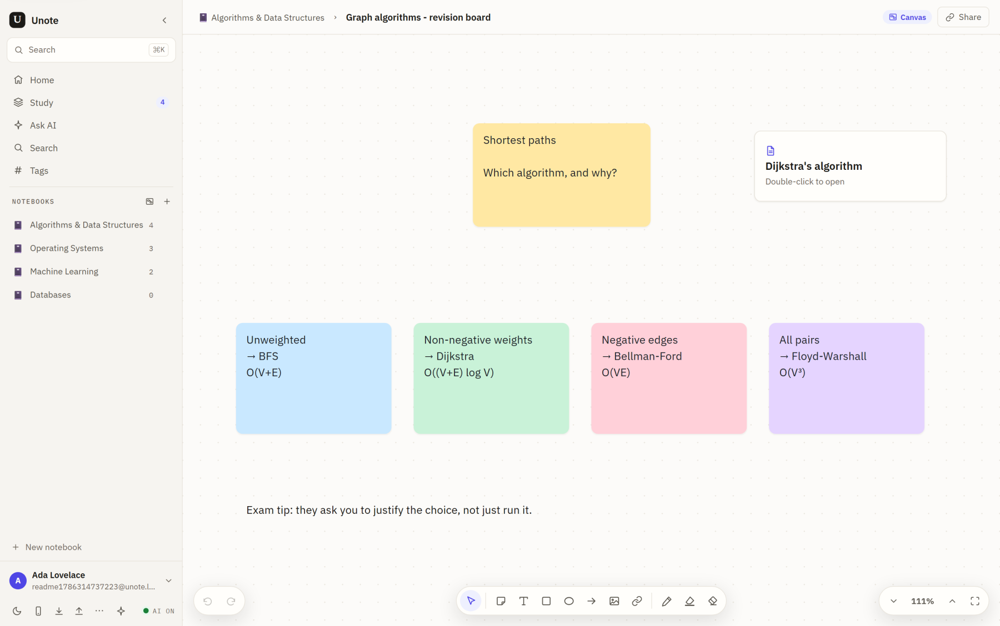
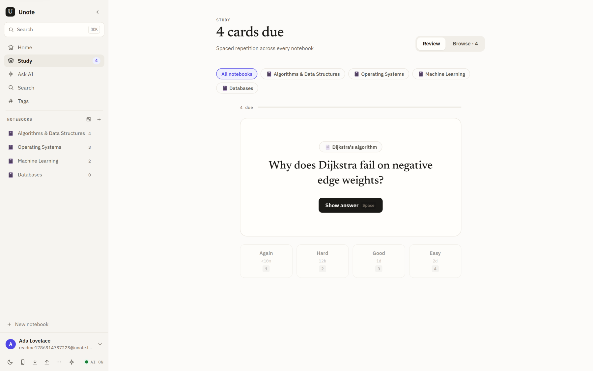
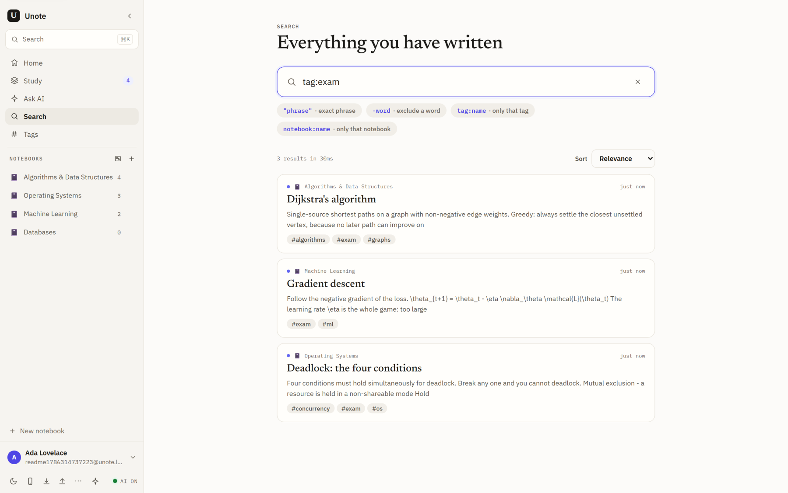

<p align="center">
  
</p>

<h1 align="center">Unote</h1>
<p align="center">A note-taking app for university students: lecture notes, flashcards, sources and infinite boards in one place, with AI that only acts when you ask it to.</p>

<p align="center">
  <a href="https://unote-six.vercel.app"></a>
  <a href="https://github.com/011-sam-110/Folio/releases/latest"></a>
  
  
  
  
</p>

Write a lecture note out of blocks (maths, code, tables, callouts, chemistry structures, 3D
models), link notes to each other with `[[wikilinks]]`, turn a passage into flashcards on a
spaced schedule, keep a checked source library for the essay you cite them in, and put the
thinking that is not paragraphs on an infinite board. Bring in what you already have: a PDF, a
slide deck, photos of handwritten pages, a lecture recording, or a Notion, Obsidian or Google
Docs export. It runs in the browser, installs as a desktop app, and keeps working with the
network off.

_Status: live at [unote-six.vercel.app](https://unote-six.vercel.app), with Windows and macOS installers on the [releases page](https://github.com/011-sam-110/Folio/releases/latest). AI needs a reachable OpenAI-compatible gateway (`FOLIO_AI_BASE_URL`): without one it reports itself unavailable on screen and everything else works normally. Google and GitHub sign-in are built but stay hidden until their client ids are set._

## ✨ Features

- **A block editor built for coursework** - slash-insert for callouts, tables, columns, toggles, to-do lists and syntax-highlighted code, plus LaTeX maths inline and as blocks, SMILES chemistry structures, and GLB, glTF, STL or OBJ 3D models you can spin in the page. Autosave keeps a version history you can restore from, and eight built-in templates (Cornell, lecture, reading notes, essay plan, problem set, lab report, seminar, weekly review) start a note off.
- **A source library that checks the source is real** - add by DOI, ISBN, URL or title search and it resolves the full record, then verifies it against the registry it came from and marks it **verified**, **refuted**, **unreachable** or **unconfirmed**, with the evidence attached. Cite in Harvard, APA, MLA, Vancouver or Chicago and switch style without a round trip, because formatting happens on the client from CSL-JSON.
- **Notes that know about each other** - `[[wikilinks]]` with autocomplete, backlinks, and unlinked mentions (where another note names this one without linking it). Tags work as chips or as inline `#hashtags`, and renaming one renames it everywhere.
- **Several notes open at once** - a tab strip across the top of the page, where a tab you switch away from stays alive: the caret, the undo history, the scroll position and whichever panels you had open are all exactly where you left them when you come back. Ctrl-click, middle-click or `+` opens a new one, and the set you had open is still there after a reload.
- **Search with operators** - Postgres full-text search taking `tag:algorithms`, `notebook:"Operating Systems"`, `"an exact phrase"` and `-excluded`, which combine.
- **Spaced repetition** - select a passage, make a card from it, review on an SM-2 schedule. Cards you find hard come back sooner.
- **Infinite boards** - stickies, shapes, images and cards that open a real note, with pressure-sensitive stylus ink and palm rejection so a resting hand on an iPad does not draw.
- **Import from wherever your notes are** - PDFs and slide decks split one note per slide, photos of handwriting with OCR, a lecture MP4 turned into slides plus a timestamped transcript **entirely in your browser**, a folder of old Markdown, and Obsidian, Notion or Google Docs exports. Pair a phone by scanning a QR code and capture straight from its camera.
- **AI that shows its work, or stays out of the way** - a chat scoped to the note you are reading, or one question asked across everything you have written with the source notes cited. Every rewrite arrives as a diff you accept or reject, so nothing changes silently. 100 free calls per account per month on a shared pool, or add your own OpenAI-compatible key and skip the quota.
- **Offline, and on the desktop** - notes, boards, ink, images and search all keep working with the network cut, and edits sync when it comes back. The same app ships as Windows and macOS installers with auto-update.
- **No account needed at either end** - start writing straight from the landing page with no signup and keep the work when you make an account later; publish any note or board behind an unguessable link, optionally password-gated, view-only or editable, with comments anchored to a passage and resolved when dealt with, and revoke it whenever.

## 📸 Screenshots

| Every source checked against its registry | Ask across every note, with the sources cited |
|---|---|
|  |  |
| The assistant, scoped to the note you are reading | An infinite board, alongside the notes |
|  |  |
| Flashcards on an SM-2 schedule | Search operators, combining |
|  |  |

## 🛠 Stack

React 19 · TypeScript · Vite 8 · TipTap 3 · Express 5 · Postgres · Dexie (the offline store) · Electron · Vitest · Playwright, deployed on Vercel with Neon Postgres.

Everything heavy runs client-side: transformers.js (Whisper transcription), tesseract.js (OCR), pdf.js, three.js and `<model-viewer>`, smiles-drawer, KaTeX.

## 🚀 Run

```bash
npm install

# any reachable Postgres works; this is the one the app expects by default
docker run -d --name folio-pg -p 5433:5432 \
  -e POSTGRES_USER=folio -e POSTGRES_PASSWORD=folio -e POSTGRES_DB=folio \
  postgres:17-alpine

npm run dev          # api on :4780, web on :5173
```

The schema applies itself on boot, so there is no migration step. `cp .env.example .env` to
point at an AI gateway and change ports. Everything except the AI features works with no
configuration at all.

```bash
npm run test -w server       # 690 unit + integration
npm run test -w web          # 459 unit
npm run e2e                  # 108 Playwright tests, 22 spec files (wants a folio_e2e database)
node scripts/smoke-api.mjs   # live-server checks; takes FOLIO_BASE, so it runs against prod too
```

> The server suite calls `DROP SCHEMA public CASCADE` on the same local database the dev
> server uses. Do the browser checks first, or expect to sign up again afterwards.

The desktop shell is the same web build inside Electron:

```bash
npm run desktop:dev          # Electron against the dev server
npm run desktop:build        # installers, via electron-builder
```

## 🧠 How it works

npm workspaces: `server/` (Express 5 + Postgres) and `web/` (React 19 + Vite), with
`api/index.ts` wrapping the whole Express app as one Vercel function.

```
web/src/
  features/editor/      TipTap schema, the insert registry, the assistant panel
  features/references/  source library, CSL-JSON, the five citation styles
  features/canvas/      infinite board: items, connectors, ink, viewport
  features/import/      PDF / PPTX / photo / lecture-MP4 / Obsidian / Notion / GDocs
  features/study/       SM-2 review loop
  features/tabs/        the tab strip, and the host that keeps several pages mounted
  lib/local/            Dexie mirror + outbox: what makes it work offline
  lib/sync/             pull/push against the monotonic change feed
server/src/
  routes/               notes, search, study, canvas, references, share, sync, imports, ai
  lib/references/       DOI / ISBN / webpage / search resolvers, and the verifier
  ai/                   tool catalogue, per-caller key resolution, quota
  schema.sql            applied on boot
```

Five decisions that are not obvious from reading the code:

**The database layer keeps `?` placeholders.** Unote was SQLite and better-sqlite3 first.
Rather than hand-edit roughly 95 SQL literals into `$1..$n` for the Postgres migration, and
risk a silent off-by-one inside a `WHERE` clause, `db.ts` mimics better-sqlite3's
`prepare(sql).all()` shape and rewrites the placeholders itself, counting them so a miscount
fails at the call site. The migration became "add `await`, scope by user" instead of a rewrite
of every route handler.

**Ownership is enforced on the parent, not the child.** `note_tags`, `canvas_items` and
`note_ink` have no `user_id` of their own, so every query that touches them joins to the
owning note and filters that. A bare `WHERE note_id = ?` would let any signed-in user reach
someone else's data by guessing an id. `server/test/ownership.test.ts` exists to keep it that
way.

**Nothing on the server formats a citation.** The references route stores and verifies
CSL-JSON and stops there, because switching from Harvard to APA has to re-render instantly and
has to keep working offline. Both rule out a round trip, so the five styles are implemented on
the client.

**Lecture import runs entirely in the browser.** A Vercel function caps request bodies around
4.5 MB and runs for 60 seconds; a lecture recording is hundreds of megabytes. So slide
detection uses the browser's own video decoder plus canvas frame-differencing, and
transcription runs Whisper through transformers.js. Only the extracted slides and captions are
ever uploaded, and the video never leaves the machine.

**Collaboration polls instead of holding a socket.** A serverless function cannot keep a
WebSocket open, so shared notes sync through a monotonic `note_events` feed that collaborators
poll for "everything since revision N". It is not instant, and the UI does not pretend it is.
